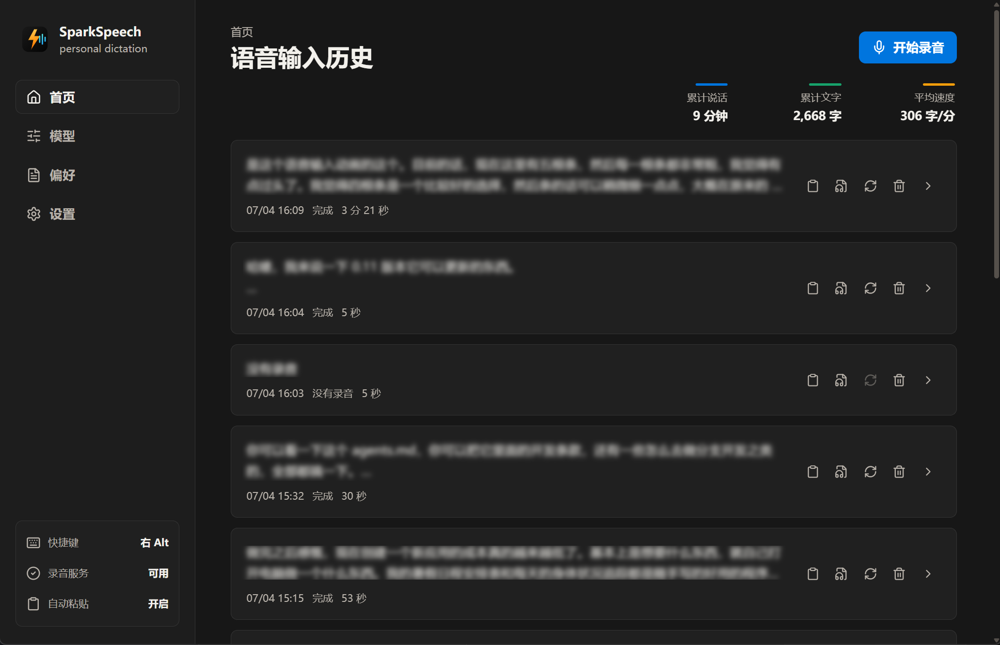

<p align="center">
  
</p>

<h1 align="center">SparkSpeech</h1>

<p align="center">
  简约、大方、开源的类闪电说智能语音输入法。
</p>

<p align="center">
  
  
  
  
</p>

<p align="center">
  
</p>

## 介绍

SparkSpeech 是一个简约、大方、开源的类闪电说智能语音输入法。按下全局快捷键开始说话，录音会先保存到本地，再交给豆包流式 ASR 转写，随后由 OpenAI-compatible 文本模型整理成适合直接粘贴的文本。

它适合日常写作、即时记录、邮件草稿、技术笔记和任何需要把口语快速变成可编辑文字的场景。应用会保留历史记录和本地录音，方便重新转写、重新优化、复制、试听和定位源文件。

## 功能

- 全局快捷键开始和结束录音。
- 底部透明状态条展示录音、转写和优化状态。
- 录音先保存到本地，再进行网络转写。
- 豆包流式语音识别。
- OpenRouter、DeepSeek 或自定义 OpenAI-compatible 文本整理。
- Preference 支持原话、轻度整理和深度整理三档整理强度。
- 历史记录支持复制、试听、打开录音文件夹、重新转写、重新优化和删除确认。
- 网络失败后保留录音，并提供回到主界面重试的提示。
- 支持整理完成自动粘贴、保存日志和开机自启动开关。
- 支持浅色、深色和跟随系统主题。
- 关闭主窗口后继续驻留系统托盘。

## 模型设置

SparkSpeech 目前固定使用豆包作为 ASR provider，并支持 OpenRouter、DeepSeek 或自定义 OpenAI-compatible API 做文本优化。模型页会把“语音识别模型”和“文本优化 Provider”分开管理。

OpenRouter 设置支持 API Key、Base URL、系统代理开关和模型列表管理；DeepSeek 和自定义 Provider 支持 API Key、Base URL 和模型名。

## 本地数据

生产数据默认位于：

```text
%APPDATA%\com.leo.sparkspeech
```

重要文件包括：

- `settings.json`
- `prompts.json`
- `records.json`
- `app.log`
- `recordings/YYYY-MM-DD/*.wav`
- `tests/microphone-test.wav`

## 开发

```powershell
npm install
npm run build
cargo check --manifest-path src-tauri/Cargo.toml
npm run tauri:dev
```

发布构建：

```powershell
npm run tauri:build -- --no-bundle
```

更多实现和发布说明见 [docs/README.md](./docs/README.md)。
